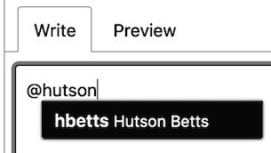

# Open Source Governance @ [FactSet](https://factset.com/)

**If you are an employee at FactSet, please refer to FactSet's _Open Source Code Use Policy_ on the corporate intranet, for details about our corporate policies with respect to Open Sourcing existing software, contributing to Open Source software during work, and contributing to Open Source software outside of work**

**This document is intended to capture our policies for maintaining Open Source projects under the _FactSet_ organization on GitHub.**

<!-- START doctoc generated TOC please keep comment here to allow auto update -->
<!-- DON'T EDIT THIS SECTION, INSTEAD RE-RUN doctoc TO UPDATE -->
## Table of Contents

- [Joining the FactSet Organization](#joining-the-factset-organization)
  - [Setup Two-factor Authentication](#setup-two-factor-authentication)
  - [Use Full Name in Your Profile](#use-full-name-in-your-profile)
- [Setting Up a Project](#setting-up-a-project)
  - [JavaScript Project](#javascript-project)
  - [GitHub Labels](#github-labels)
- [Common Issues](#common-issues)
  - [Disabling Two Factor Authentication](#disabling-two-factor-authentication)

<!-- END doctoc generated TOC please keep comment here to allow auto update -->

## Joining the FactSet Organization

There are a few tasks that will need to be completed prior to joining the FactSet organization as an employee or outside collaborator.

Some tasks are requirements while others will simply make your experience, and that of others, better.

### Setup Two-factor Authentication

> **Required**

All accounts belonging to the `factset` organization must have [2FA authentication enabled with GitHUb](https://help.github.com/articles/securing-your-account-with-two-factor-authentication-2fa/).

### Use Full Name in Your Profile

Through your [profile settings page](https://github.com/settings/profile) please use your full name on your public profile so that it's easy for members within the organization, and non-organization contributors, to find you.

An example of using a person's first name to discover them using [GitHub's _mention_ feature](https://blog.github.com/2011-03-23-mention-somebody-they-re-notified/).



## Setting Up a Project

Here are our recommendations for workflow integrations when setting up a new project in FactSet's organization.

### JavaScript Project

* Continuous Integration - https://github.com/marketplace/circleci
* Code Coverage Reports - https://github.com/marketplace/codecov
* Automated Dependency Updates - https://github.com/marketplace/renovate

### GitHub Labels

A set of suggested [GitHub Labels](https://help.github.com/articles/about-labels/) are available in our [`labels`.json](./labels.json) file.

To deploy these labels to a project, please install [`github-sync-labels-milestones`](https://www.npmjs.com/package/github-sync-labels-milestones), download the `labels.json` file (or clone this repository), and run the following:

```bash
github-sync-labels-milestones --token [PERSONAL ACCESS TOKEN] --config labels.json
```

> **Note:** Please create a [_Personal Access Token_](https://help.github.com/articles/creating-a-personal-access-token-for-the-command-line/) with repository access to all repositories listed in the `labels.json` file and pass that token to the `--token` flag.

## Common Issues

While working on Open Source projects under the FactSet organization, you may encounter the following common issues.

### Disabling Two Factor Authentication

[According to GitHub](https://help.github.com/articles/disabling-two-factor-authentication-for-your-personal-account/):

> Warning: If you're a member, billing manager, or outside collaborator to a public repository of an organization that requires two-factor authentication and you disable 2FA, you'll be automatically removed from the organization, and you'll lose your access to their repositories. To regain access to the organization, re-enable two-factor authentication and contact an organization owner.

In the event that you disable, and then re-enable, 2FA, please reach out to a member of the organization to be re-invited.
